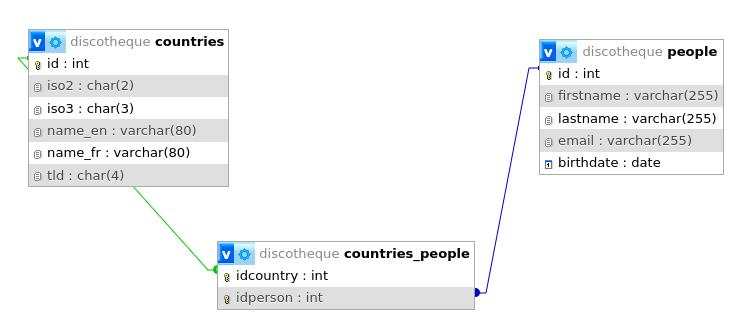

# HelloDojo Marketing

Ce fichier permet de consigner et documenter les étapes que vous avez suivies
pour répondre aux demandes du [README.md](README.md).

## Mise en place

<!-- 
Vous devez expliquer ici quelle solution technique vous avez choisie, comment
il faut procéder pour l'installer, quelles sont les commandes ou les étapes à
suivre pour importer les tables, quel outil vous avez utilisé pour créer le
schéma entité-relation de la base, et toutes autres informations qui pourraient
vous sembler utiles dans le but qu'une autre personne puisse **reproduire** 
votre démarche.
-->

FIXME : Pas très clair cette partie (place de DBeaver là dedans ?)...

J'ai créé un *docker-compose.yml* pour lancer mysql et phpmyadmin puis j'ai importé les trois fichier *.sql* via l'interface de phpmyadmin.

Phpmyadmin a généré le schéma.



## Informations à récolter

### Générales

1. La table `people` contient 410 personnes, ma requête est :
  ```sql
  SELECT count(id) as nb_pers FROM people;
  ```
2. Cette requête permet de trouver l'email de la personne dont le nom de
   famille est Warren :
  ```sql
  SELECT email FROM people WHERE lastname = "Warren";
  ```
3. La table `people` est triée par nom de famille en ordre croissant, ma requête 
   est :
  ```sql
  SELECT * FROM people ORDER BY lastname;
  ```
4. Les 5 premières entrées de la table `people` triée par nom de famille en 
   ordre croissant sont :
  ```sql
  SELECT * FROM people ORDER BY lastname LIMIT 5;
  ```
5. Je trouve toutes les personnes dont le nom ou le prénom contient `ojo`, ma  
   requête est :
  ```sql
  SELECT * FROM people WHERE firstname LIKE '%ojo%' OR lastname LIKE '%ojo%';
  ```
6. Les 5 personnes les plus jeunes sont obtenues avec cette requête :
  ```sql
  SELECT * FROM people ORDER BY birthdate DESC LIMIT 5;
  ```
6. Les 5 personnes les plus agées sont obtenues avec cette requête :
  ```sql
  SELECT * FROM people ORDER BY birthdate LIMIT 5;
  ```
7. La requête suivante permet de trouver l'age (en année) de chaque personne :
  ```sql
  SELECT *,  FLOOR(DATEDIFF(CURRENT_DATE, birthdate) / 365) AS age FROM people ORDER BY age;
  ```
8. La moyenne d'age (en année) est 30, ma requête est :
  ```sql
  SELECT ROUND(AVG(FLOOR(DATEDIFF(CURRENT_DATE, birthdate) / 365)), 2) AS moy_age FROM people;
  ```
9. Le prénom le plus long est Clementine, ma requête est :
  ```sql
  SELECT *, LENGTH(firstname) AS long_firstname FROM people WHERE LENGTH(firstname) = (SELECT MAX(LENGTH(firstname)) FROM people);
  ```
9. Le nom de famille le plus long est Christensen, ma requête est:
  ```sql
  SELECT *, LENGTH(lastname) AS long_lastname FROM people WHERE LENGTH(lastname) = (SELECT MAX(LENGTH(lastname)) FROM people);
  ```
10. Les plus longues paires "nom + prénom" sont Wallace Christensen et Cheyenne Pennington, ma requête est :
  ```sql
  SELECT *, (LENGTH(firstname) + LENGTH(lastname)) AS long_firstname_lastname FROM people WHERE (LENGTH(firstname) + LENGTH(lastname)) = (SELECT MAX((LENGTH(firstname) + LENGTH(lastname))) FROM people);
  ```
11. La table `people` contient 0 doublon, ma requête est :
  ```sql
  SELECT count(DISTINCT id) as nb_pers FROM people;
  ```

### Invitations

1. Pour lister tous les membres de plus de 18 ans :
  ```sql
  SELECT * FROM people WHERE (DATEDIFF(CURRENT_DATE, birthdate) / 365) > 18;
  ```
1. Pour lister tous les membres de plus de 18 ans et de moins de 60 ans :
  ```sql
  SELECT * FROM people WHERE (DATEDIFF(CURRENT_DATE, birthdate) / 365) BETWEEN 18 AND 60;
  ```
1. Pour lister tous les membres de plus de 18 ans, de moins de 60 ans et qui 
   une addresse email valide :
  ```sql
  SELECT * FROM people WHERE ((DATEDIFF(CURRENT_DATE, birthdate) / 365) BETWEEN 18 AND 60) AND (email LIKE '%@%.%');
  ```
2. Pour ajoutez une colonne `age` dans le résultat de la requête :
  ```sql
  SELECT *, FLOOR(DATEDIFF(CURRENT_DATE, birthdate) / 365) AS age FROM people WHERE (FLOOR(DATEDIFF(CURRENT_DATE, birthdate) / 365) BETWEEN 18 AND 60) AND (email LIKE '%@%.%');
  ```
3. Pour générer un champs contenant `Prénom Nom <email@provider.com>;` :
  ```sql
  SELECT *, FLOOR(DATEDIFF(CURRENT_DATE, birthdate) / 365) AS age, CONCAT(firstname, " ", lastname, " ", email) AS liste FROM people WHERE (FLOOR(DATEDIFF(CURRENT_DATE, birthdate) / 365) BETWEEN 18 AND 60) AND (email LIKE '%@%.%');
  ```
4. Avec cette requête :  
  ```sql
  SELECT COUNT(*) FROM people WHERE email LIKE '%@%.ch';
  ```  
  je peux estimer que 70 personnes habitent en Suisse.

### Countries

FIXME : Pas compris la consigne...

1. La requête qui permet d'obtenir la liste d'options sous la forme :  
   `<option value="XXX">XXX</option>` est :  
  ```sql
  SELECT somecolumns FROM sometable [...];
  ```
1. Pour avoir la liste d'options en plusieurs langues, je procède de la manière 
   suivante :  
  ```sql
  SELECT somecolumns FROM sometable [...];
  ```

### Jointure

1. Avec cette requête :
  ```sql
  SELECT people.* FROM people LEFT JOIN countries_people ON people.id = countries_people.idperson LEFT JOIN countries ON countries_people.idcountry = countries.id WHERE countries.name_fr = 'Suisse';
  ```    
   je sais que 371 personnes habitent en Suisse.

2. Avec cette requête :
  ```sql
  SELECT people.* FROM people LEFT JOIN countries_people ON people.id = countries_people.idperson LEFT JOIN countries ON countries_people.idcountry = countries.id WHERE countries.name_fr <> 'Suisse';
  ```  
   je sais que 43 personnes n'habitent pas en Suisse.

3. Avec cette requête :
  ```sql
  SELECT people.lastname, people.firstname FROM people LEFT JOIN countries_people ON people.id = countries_people.idperson LEFT JOIN countries ON countries_people.idcountry = countries.id WHERE countries.name_fr IN ('France', 'Allemagne', 'Italie', 'Autriche', 'Liechtenstein');
  ```  
  je liste (nom & prénom) les membres habitants en France, Allemagne, Italie, Autriche et Liechtenstein.

4. Cette requête :
  ```sql
  SELECT c.id, c.name_fr, (SELECT COUNT(people.id) FROM people LEFT JOIN countries_people ON people.id = countries_people.idperson WHERE countries_people.idcountry = c.id) AS nb_pers FROM countries AS c ORDER BY c.name_fr;
  ```  
   permet de compter combien il y a de personnes par pays.

5. Cette requête :
  ```sql
  SELECT c.id, c.name_fr FROM countries AS c WHERE (SELECT COUNT(people.id) FROM people LEFT JOIN countries_people ON people.id = countries_people.idperson WHERE countries_people.idcountry = c.id) = 0 ORDER BY c.name_fr;
  ```  
  liste les pays qui ne possèdent pas de personnes.

6. En exécutant cette requête :
  ```sql
  SELECT idperson, people.* FROM countries_people LEFT JOIN people ON countries_people.idperson = people.id GROUP BY idperson HAVING COUNT(idperson) > 1;
  ```  
   je sais que Dai Roth et Minerva Chaney sont liés à plusieurs pays.

7. En exécutant cette requête :
  ```sql
  SELECT * FROM people WHERE id NOT IN (SELECT people.id FROM countries_people INNER JOIN people ON countries_people.idperson = people.id);
  ```  
  je sais que toutes les personnes de la table people sont représentées au moins une fois dans la table countries_people parce que la requête ci-dessus ne retourne aucun résultat. Il n'y a donc personne qui est lié à aucun pays.

8. De la manière suivante :
  ```sql
  SELECT c.id, c.name_fr, ROUND(((SELECT COUNT(people.id) FROM people LEFT JOIN countries_people ON people.id = countries_people.idperson WHERE countries_people.idcountry = c.id) / (SELECT COUNT(id) FROM people) * 100), 2) AS pourcentage FROM countries AS c ORDER BY c.name_fr;
  ```  
  nous pouvons afficher le pourcentage de personnes par pays.


### Procédures

TODO

1. Cette requête permet d'extraire le `tld` de l'adresse email et de le lier à la table `countries` :  
  ```sql
  SELECT somecolumns FROM sometable [...];
  ```  
1. Pour ajouter une chaine si la jointure ne retourne rien, j'ai procédé de la manière suivante :  
  `STRING`
1. Avec `STRING`, nous pouvons partager le mécanisme qui extrait le `tld`.
  ```sql
  SELECT somecolumns FROM sometable [...];
  ```

### Vue SQL

1. J'ai créé une vue bien pratique contenant toutes les infomrations utiles à un humain. Ma requête est:  
  ```sql
  CREATE viewsomething as somequery [...];
  ```  
1. Je peux exporter ma vue au format CSV avec la requête :
  ```sql
  SELECT somecolumns FROM sometable [...];
  ```

### Finances

1. J'ai créé une table pour les finances. Ma requête est:  
  ```sql
  CREATE sometable [...];
  ```
1. J'ai ajouté des données de test avec la reuêtes SQL suivante :  
   ```sql
   INSERT INTO expenses [...];
   ```
1. J'ai modifié la vue en y ajoutant les finances. Ma requête est:  
  ```sql
  UPDATE someview [...];
  ```

### Intégrité référentielle
(WIP)
1. Pour ajouter les clés étrangères, j'ai utilisé les requêtes suivantes :  
  ```sql
  ALTER sometable [...];
  ALTER sometable [...];
  ```
1. J'ai du modifier les données de la table `NAME` parce que XXX.
